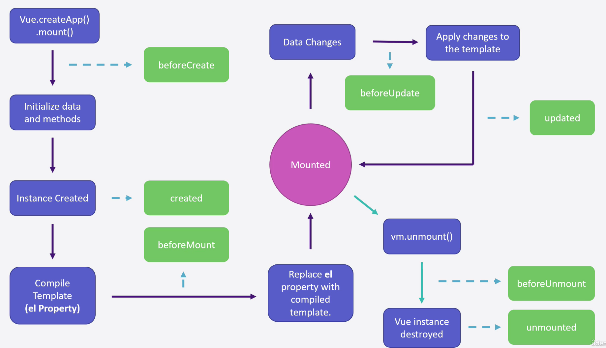

# Vue Beyond the Fundamentals

## Mounting the Vue instance

-   Vue.createApp : 建立一個 instance
-   .mount(#app) : 將 vue instance mount 到 DOM 上

```javascript
let vm = Vue.createApp({
    data() {
        return {
            message: "Hello Worold",
        };
    },
});

vm.mount("#app");
// setTimeout(() => {
//     vm.mount("#app");
// }, 3000);
```

---

## vue lifecycle



生命週期實際操作

```javascript
let vm = Vue.createApp({
    data() {
        return {
            message: "Hello Worold",
        };
    },
    beforeCreate() {
        console.log("beforeCreate() function called", this.message);
    },
    created() {
        console.log("created() function called", this.message);
    },
    beforeMount() {
        console.log("beforeMount() function called", this.$el);
    },
    mounted() {
        console.log("mounted() function called", this.$el);
    },
    beforeUpdate() {
        console.log("beforeUpdeate() function called");
    },
    updated() {
        console.log("updeated() function called");
    },
    beforeUnmount() {
        console.log("beforeUnmount() function called!");
    },
    unmounted() {
        console.log("unmount() function called!");
    },
});

vm.mount("#app");
```

---

## Virtual DOM

解釋:The virtual DOM is a js object. It is a lightweight copy of the actual DOM. It's faster to perform comparisons and updateds on the Virtual DOM than it is to perform them on the actual DOM.

簡單來說 vue 會把更動的東西先更動在 vitrual dom，virtual DOM 會透過 diff 技術去比對真實的 DOM，然後根據有異動的地方去做 re-render

---

## Proxy Object

[參考文章](https://blog.twjoin.com/%E7%AD%86%E8%A8%98-javascript-proxy-27efab4f0b81)

代理物件（Proxy Object）是 JavaScript 中的一種特殊物件，它允許你建立一個代理來控制對另一個物件的存取和操作。這個代理物件允許你在目標物件上定義自訂行為，例如攔截並定制對目標物件屬性的存取、修改、刪除等操作。

代理物件透過在目標物件周圍加入一個虛擬的層來運作，它會攔截對目標物件的各種操作並在這些操作上執行自定義邏輯。這種機制為開發者提供了對物件操作的靈活控制，可用於實現許多高級特性和功能。

以下是代理物件的一些特性：

1. 攔截器（Handler）：代理物件透過一個稱為攔截器的物件來定義各種操作的行為。這些操作包括 get、set、deleteProperty、apply 等等。

2. 攔截操作：代理物件可以攔截目標物件的多種操作，如屬性存取、賦值、刪除、方法調用等。

3. 自定義行為：通過在攔截器中定義行為，可以實現對操作的定制邏輯，例如實現資料驗證、阻止屬性的賦值或刪除等。

```javascript
// 建立一個目標物件
const target = {
    name: "Alice",
    age: 30,
};

// 建立一個代理物件，攔截屬性存取並添加自定義行為
const proxy = new Proxy(target, {
    get(target, property) {
        console.log(`存取了屬性 ${property}`);
        return target[property];
    },
    set(target, property, value) {
        console.log(`設定了屬性 ${property} 的值為 ${value}`);
        target[property] = value;
    },
});

// 通過代理物件存取及設定屬性
console.log(proxy.name); // 輸出：存取了屬性 name
proxy.age = 35; // 輸出：設定了屬性 age 的值為 35
console.log(proxy.age); // 輸出：存取了屬性 age
```

---

## Vue Compiler

-   one version with the compiler
-   one version without the compiler
    -   Pros : 30% Lighter than the full version.
    -   Cons : Diffcult to read
