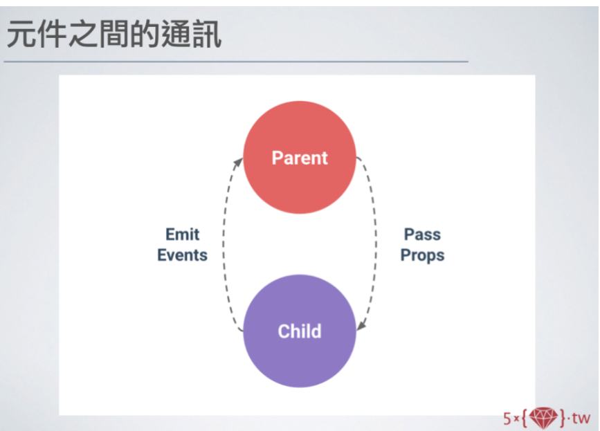

# Advanced Vue Components

## 資料夾結構

-   index.html : 整個專案的入口點
-   main.js : 是專案的程式進入點，剛建立完成的內容如下：
-   App.vue : 通常只會有一個，作為整個網頁的根元件
-   components: 放元件檔
-   assets: 放靜態檔，如圖片、css 檔
-   vite.config.js : vite 的設定檔
    -   plugin，postcss 也是在這裡加上去
    -   alias: 可以設定一些簡寫，@ 可以替代./src

```javascript
export default defineConfig({
    plugins: [vue()],
    resolve: {
        alias: {
            "@": fileURLToPath(new URL("./src", import.meta.url)),
        },
    },
});

// No alias:
// import Example from 'src/example'

// With alias:
// import Example from '@/example'
```

[參考文章](https://ithelp.ithome.com.tw/articles/10293243)

---

## Vue Components

### Global Components

<b> 宣告在 main.js 裡面 </b>
用.component 接
在其他 vue 要引用這個 component 就直接下

```vue
<Greeting></Greeting>
```

```javascript
import { createApp } from "vue";
import { createPinia } from "pinia";
import Greeting from "@/components/Greeting.vue";

import App from "./App.vue";

const app = createApp(App);

app.use(createPinia());
app.component("Greeting", Greeting);
app.mount("#app");
```

### Local components

在某個 vue 元件下引用:

App.vue

```javascript
<script>
import Greeting from "./components/Greeting.vue";

export default {
    name: "App",
    components: {
        Greeting,
    },
    data() {
        return {
            msg: "Hello Vue3!",
        };
    },
};
</script>

// 如果是用script setup ，這樣就可以
<script setup>
import Greeting from './components/Greeting.vue'
</script>

<template>
    <h1>{{ msg }}</h1>
    <Greeting></Greeting>
</template>

<style scoped></style>
```

---

## style & style scoped

-   style:
    -   `<style>`標籤是全域樣式，它的樣式將對整個應用程式或頁面生效。
    -   在使用全域樣式時，樣式定義可能會影響到整個應用程式的其他部分，因此較難確保樣式的封閉性。
-   style scoped:
    -   帶有 scoped 屬性的 `<style scoped>` 標籤是區域樣式，它的樣式只對當前組件生效，不會影響其他組件。
    -   Vue.js 會為每個使用了 scoped 的樣式生成一個唯一的 class，並將這個 class 添加到組件的根元素上，這樣可以實現樣式的封閉性。

---

## using scss in project

安裝:

-   npm install sass --save-dev

引用:

-   `<style scoped  lang="scss">`

---

## props

父元件:App.vue
子元件:User.vue,Greeting.vue

```
            App.vue
 (props)   /       \  (props)
    User.vue       Greeting.vue

```

App.vue
父元件要在子元件上加上:age="age" --> 代表把這個參數傳給子元件

```javascript
<script>
import Greeting from "./components/Greeting.vue";
import User from "./components/User.vue";
export default {
    name: "App",
    components: {
        Greeting,
        User,
    },
    data() {
        return {
            msg: "Hello Vue3!",
            age: 20,
        };
    },
};
</script>

<template>
    <h1>{{ msg }}</h1>
    <p>Hello App.vue</p>
    <p>{{ age }}</p>
    <!-- <button type="button" @click="age++">Update Age</button> -->
    <Greeting :age="age"> </Greeting>
    <user :age="age"></user>
</template>

```

User.vue
子元件用 props:["age"]去接父傳過來的 props

```javascript
<template>
    <button type="button" @click="age++">Update Age</button>
    <h1>{{ msg }}</h1>
    <h2>The user is {{ age }} years old.</h2>
</template>

<script>
export default {
    name: "User",
    props: ["age"],
    data() {
        return {
            msg: "user",
        };
    },
};
</script>
```

### props 的限制

-   父元件:App.vue
-   子元件:Greeting.vue 跟 User.vue
-   props: age

##### User.vue

我在 User.vue 上加上一個 button 對 age 做+1 的動作

```javascript
<template>
    <button type="button" @click="age++">Update Age</button>
    <h1>{{ msg }}</h1>
    <h2>The user is {{ age }} years old.</h2>
</template>

<script>
export default {
    name: "User",
    props: ["age"],
    data() {
        return {
            msg: "user",
        };
    },
};
</script>
```

###### Greeting.vue

然後我在 Greeting.vue 加上一個判斷式
如果 age 大於 25 顯示某個字串

```javascript
<template>
    <div>
        <p v-if="age > 25">{{ msg }}</p>
        <p v-else>You must be 25 years or older to view this message</p>
    </div>
    <div class="box"></div>
</template>

<script>
export default {
    name: "Greeting",
    props: ["age"],
    data() {
        return {
            msg: "Hahaha Greeting Vue!!!",
        };
    },
};
</script>

<style scoped lang="scss">
@mixin size($w, $h) {
    width: $w;
    height: $h;
}
p:hover {
    color: darken($color: #cc4444, $amount: 10%);
}
.box {
    @include size(100px, 100px);
    border: 1px solid #000;
}
</style>

```

**此時的 age 在 user 這邊會因為點擊按鈕而+1。但 Greeting.vue 的 age 卻沒有變動**

**因為沒有把 props 變更的值回傳給父元件**

#### 如何解決 props 的限制?



User.vue
子元件用**this.$emit** 傳送參數給父元件

```javascript
<template>
    <button type="button" @click="onClickAge">Update Age</button>
    <h1>{{ msg }}</h1>
    <h2>The user is {{ age }} years old.</h2>
</template>

<script>
export default {
    name: "User",
    props: ["age"],
    data() {
        return {
            msg: "user",
        };
    },
    methods: {
        onClickAge() {

            this.$emit("age-change");

            // 傳參數的值
            // this.$emit("age-change", 3);
        },
    },
};
</script>


```

App.vue
父元件用 @去接子元件傳回的參數

```javascript
<script>
import Greeting from "./components/Greeting.vue";
import User from "./components/User.vue";
export default {
    name: "App",
    components: {
        Greeting,
        User,
    },
    data() {
        return {
            msg: "Hello Vue3!",
            age: 20,
        };
    },
    methods: {
        updateAge(num) {
            this.age += num;
        },
    },
};
</script>

<template>
    <h1>{{ msg }}</h1>
    <p>Hello App.vue</p>
    <p>{{ age }}</p>
    <!-- <button type="button" @click="age++">Update Age</button> -->
    <Greeting :age="age"> </Greeting>
    <user :age="age" @age-change="age++"></user>
    // <user :age="age" @age-change="updateAge"></user>
</template>
```

---

## Callback Functions

-   App.vue 有兩個 methods:updateAge(num)、updateAgeCB(num)
-   :ageChangeFn="updateAgeCB" -> 把這個 function 傳給子元件 User

App.vue

```javascript
<script>
import Greeting from "./components/Greeting.vue";
import User from "./components/User.vue";

export default {
    name: "App",
    components: {
        Greeting,
        User,
    },
    data() {
        return {
            msg: "Hello Vue3!",
            age: 2,
        };
    },
    methods: {
        updateAge(num) {
            this.age += num;
        },
        updateAgeCB(num) {
            this.age += num;
        },
    },
};
</script>

<template>
    <h1>{{ msg }}</h1>
    <p>Hello App.vue</p>
    <p>{{ age }}</p>
    <!-- <button type="button" @click="age++">Update Age</button> -->
    <Greeting :age="age"> </Greeting>
    <user :age="age" @age-change="updateAge" :ageChangeFn="updateAgeCB"></user>
</template>


```

User.vue

-   ageChangeFn: Function --> 用 ageChangeFn 去接

```javascript
<template>
    <button type="button" @click="onClickAge">Update Age Event</button>
    <button type="button" @click="ageChangeFn(3)">Update Age CB</button>
    <h1>{{ msg }}</h1>
    <h2>The user is {{ age }} years old.</h2>
    <p>{{ ageDouble }}</p>
</template>

<script>
export default {
    name: "User",
    props: {
        age: {
            type: Number,
            // required: true,
            // default: 20,
            validator(value) {
                return value < 130;
            },
        },
        ageChangeFn: Function,
    },
    emits: ["age-change"],
    computed: {
        ageDouble() {
            return this.age * 2;
        },
    },
    data() {
        return {
            msg: "user",
        };
    },
    methods: {
        onClickAge() {
            this.$emit("age-change", 10);
        },
    },
};
</script>

```

### emit v.s callback function

-   emit :
    -   作用： 用於從子組件向父組件傳遞信息。
    -   使用場景： 當子組件需要通知父組件發生了某些事件，可以使用 emit 來觸發父組件中的事件處理函數。
-   callback function
    -   作用： 通過將一個函數傳遞為 props，子組件可以調用該函數向父組件傳遞信息。
    -   使用場景： 適用於需要子組件主動調用父組件提供的函數來傳遞數據的情境。

**總結：**

-   如果是子組件需要通知父組件某些事件發生，使用 emit 來觸發事件。
-   如果是子組件需要主動向父組件傳遞數據，可以通過 callback function 的方式。
